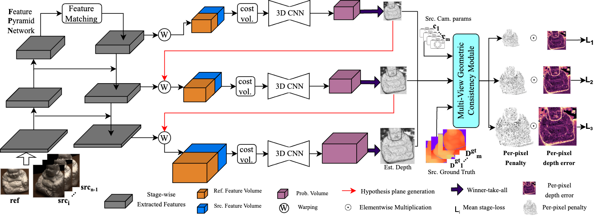

# Blending 3D Geometry and Machine Learning for Multi-View Stereopsis

Authors: Vibhas K. Vats, Md. Alimoor Reza, David J. Crandall, and Soon-heung Jung

**NOTE**: Please contact Vibhas Vats (vkvatsdss@gamil.com) for any help. 


## Abstract
Traditional multi-view stereo (MVS) methods primarily depend on 
photometric and geometric consistency constraints. 
In contrast, modern learning-based algorithms often rely 
on the plane sweep algorithm to infer 3D geometry, 
applying explicit geometric consistency (GC) checks 
only as a post-processing step, with no impact on the 
learning process itself. In this work, we introduce GC-MVSNet++, 
a novel approach that actively enforces geometric consistency of 
reference view depth maps across multiple source views (multi-view) 
and at various scales (multi-scale) during the learning phase (see Fig. 1 above). 
This integrated GC check significantly accelerates the learning 
process by directly penalizing geometrically inconsistent pixels, 
effectively halving the number of training iterations 
compared to other MVS methods. Furthermore, we introduce a densely connected 
cost regularization network with two distinct block 
designs—simple and feature-dense—optimized to harness dense 
feature connections for enhanced regularization. 
Extensive experiments demonstrate 
that our approach achieves a new state-of-the-art on the 
DTU and BlendedMVS datasets secure second place 
on the Tanks and Temples benchmark. To our knowledge, 
GC-MVSNet++ is the first method to enforce multi-view, 
multi-scale geometric consistency during learning.


## GC-MVSNet++ Architecture



## Cloning the Repo
Our code is tested with Python==3.9 and above, PyTorch==2.0 and above,  CUDA==10.8 and above on LINUX systems with NVIDIA GPUs. 

To use GC-MVSNet, clone this repo:
```
git clone 
cd GC-MVSNet
```


## Data preparation
In GC-MVSNet, we mainly use [DTU](https://roboimagedata.compute.dtu.dk/), [BlendedMVS](https://github.com/YoYo000/BlendedMVS/) and [Tanks and Temples](https://www.tanksandtemples.org/) to train and evaluate our models. You can prepare the corresponding data by following the instructions below.

### DTU
For DTU training set, you can download the preprocessed [DTU training data](https://drive.google.com/file/d/1eDjh-_bxKKnEuz5h-HXS7EDJn59clx6V/view)
 and [Depths_raw](https://virutalbuy-public.oss-cn-hangzhou.aliyuncs.com/share/cascade-stereo/CasMVSNet/dtu_data/dtu_train_hr/Depths_raw.zip)
 (both from [Original MVSNet](https://github.com/YoYo000/MVSNet)), and unzip them to construct a dataset folder like:
```
dtu_training
 ├── Cameras
 ├── Depths
 ├── Depths_raw
 └── Rectified
```
For DTU testing set, you can download the preprocessed [DTU testing data](https://drive.google.com/open?id=135oKPefcPTsdtLRzoDAQtPpHuoIrpRI_) (from [Original MVSNet](https://github.com/YoYo000/MVSNet)) and unzip it as the test data folder, which should contain one ``cams`` folder, one ``images`` folder and one ``pair.txt`` file.

### BlendedMVS
We use the [low-res set](https://1drv.ms/u/s!Ag8Dbz2Aqc81gVDgxb8MDGgoV74S?e=hJKlvV) of BlendedMVS dataset for both training and testing. You can download the [low-res set](https://1drv.ms/u/s!Ag8Dbz2Aqc81gVDgxb8MDGgoV74S?e=hJKlvV) from [orignal BlendedMVS](https://github.com/YoYo000/BlendedMVS) and unzip it to form the dataset folder like below:

```
BlendedMVS
 ├── 5a0271884e62597cdee0d0eb
 │     ├── blended_images
 │     ├── cams
 │     └── rendered_depth_maps
 ├── 59338e76772c3e6384afbb15
 ├── 59f363a8b45be22330016cad
 ├── ...
 ├── all_list.txt
 ├── training_list.txt
 └── validation_list.txt
```

### Tanks & Temples
Download our preprocessed [Tanks and Temples dataset](https://drive.google.com/file/d/1IHG5GCJK1pDVhDtTHFS3sY-ePaK75Qzg/view?usp=sharing) and unzip it to form the dataset folder like below:
```
tankandtemples
 ├── advanced
 │  ├── Auditorium
 │  ├── Ballroom
 │  ├── ...
 │  └── Temple
 └── intermediate
        ├── Family
        ├── Francis
        ├── ...
        └── Train
```

## TRAINING

### Training on DTU
Set the configuration in ``train.sh``:

* ``MVS_TRAINING``: traing data path
* ``LOG_DIR``: checkpoint saving path
* ``MASK_TYPE``: mask name 
* ``CONS2INCO_TYPE``: type of averaging operatio for geometric mask
* ``AVERAGE_WEIGHT_GAP``: decide the range of geometric penalty
* ``OPERATION``: operation between penalty and per-pixel error
* ``nviews``: nviews for the network, default 5
* ``GEO_MASK_SUM_TH``: value of M
* ``R_DEPTH_MIN_THRESH``: stage-wise RDD threshold
* ``DIST_THRESH``: stage-wise PDE threshold
* ``LR``: learning rate
* ``LREPOCHS``: learning rate decay epochs:decay factor
* ``weight_decay``: weight decay term
* ``EPOCHS``: training epochs
* ``NGPUS``: no of gpus
* ``BATCH_SIZE``: batch size
* ``ndepths``: stage-wise number of depth hypothesis planes
* ``DLOSSW``: stage-wise weights for loss terms
* ``depth_interval_ratio``: depth interval ratio

### Finetune on BlendedMVS
For a fair comparison with other SOTA methods on Tanks and Temples benchmark, we finetune our model on BlendedMVS dataset after training on DTU dataset.

Set the configuration in ``finetune_bld.sh``:

### Testing on DTU

**Important Tips:** to reproduce our reported results, you need to:
* compile and install the modified `gipuma` from [Yao Yao](https://github.com/YoYo000/fusibile) as introduced below
* use the latest code as we have fixed tiny bugs and updated the fusion parameters
* make sure you install the right version of python and pytorch, use some old versions would throw warnings of the default action of `align_corner` in several functions, which would affect the final results
* be aware that we only test the code on 2080Ti and Ubuntu 18.04, other devices and systems might get slightly different results
* make sure that you use the `gcmvsnet.ckpt` for testing

**NOTE**: After all these, you still might not be able to exactly reproduce the results on DTU. The final results on DTU also depends on fusion hyperparameters and your hardware. But you should not get much different numbers from the report numbers. 


To start testing, set the configuration in ``test_dtu.sh``:
* ``TESTPATH``: test directory  
* ``TESTLIST``: do not change
* ``FUSIBLE_PATH``: path to fusible of fusibile
* ``CKPT_FILE``: model checkpoint
* ``OUTDIR``: output directory
* ``DEVICE_ID``: GPU ID
* ``max_h``=864 (Do not change)
* ``max_w``=1152 (Do not change)
**Gipuma filter paramerters**
* ``FILTER_METHOD``: gipuma
* ``gipuma_prob_thresh``: probability threshold for Fusibile
* ``gipuma_disparity_thresh``: disparity threhold for Fusibile
* ``gipuma_num_consistenc``: View consistency threshold for Fusibile
* ``depth_interval_ratio``: Depth interval ratio
* ``ndepths``: same as traning

Run:
```
bash test_dtu.sh
```
**Note: we use the `gipuma` fusion method by default**. 

<!-- The simple instruction for installing and compiling `gipuma` can be found [here](https://github.com/YoYo000/MVSNet#post-processing).  The installed gipuma is a modified version from [Yao Yao](https://github.com/YoYo000/fusibile).-->
To install the `gipuma`, clone the modified version from [Yao Yao](https://github.com/YoYo000/fusibile).
Modify the line-10 in `CMakeLists.txt` to suit your GPUs. Othervise you would meet warnings when compile it, which would lead to failure and get 0 points in fused point cloud. For example, if you use 2080Ti GPU, modify the line-10 to:
```
set(CUDA_NVCC_FLAGS ${CUDA_NVCC_FLAGS};-O3 --use_fast_math --ptxas-options=-v -std=c++11 --compiler-options -Wall -gencode arch=compute_70,code=sm_70)
```
If you use other kind of GPUs, please modify the arch code to suit your device (`arch=compute_XX,code=sm_XX`).
Then install it by `cmake .` and `make`, which will generate the executable file at `FUSIBILE_EXE_PATH`.
Please note 


For quantitative evaluation on DTU dataset, download [SampleSet](http://roboimagedata.compute.dtu.dk/?page_id=36) and [Points](http://roboimagedata.compute.dtu.dk/?page_id=36). Unzip them and place `Points` folder in `SampleSet/MVS Data/`. The structure looks like:
```
SampleSet
├──MVS Data
      └──Points
```
In ``DTU-MATLAB/BaseEvalMain_web.m``, set `dataPath` as path to `SampleSet/MVS Data/`, `plyPath` as directory that stores the reconstructed point clouds and `resultsPath` as directory to store the evaluation results. Then run ``DTU-MATLAB/BaseEvalMain_web.m`` in matlab.

#### GC-MVSNet ++ evaluation on DTU and BlendedMVS dataset


#### GC-MVSNet ++ evaluation on Tanks and Temples dataset


### Testing on Tanks and Temples
We recommend using the finetuned models to test on Tanks and Temples benchmark.

Similarly, set the configuration in ``test_tnt.sh`` as described before. By default, we use dynamic filternation for TnT. 

To generate point cloud results, just run:
```
bash test_tnt.sh
```
Note that：
* The parameters of point cloud fusion have not been studied thoroughly and the performance can be better if cherry-picking more appropriate thresholds for each of the scenes.
* The dynamic fusion code is borrowed from [AA-RMVSNet](https://github.com/QT-Zhu/AA-RMVSNet).

For quantitative evaluation, you can upload your point clouds to [Tanks and Temples benchmark](https://www.tanksandtemples.org/).

## Citation

```bibtex
@InProceedings{vats2023gcmvsnet,
    author    = {Vats, Vibhas K and Joshi, Sripad and Crandall, David and Reza, Md. and Jung, Soon-heung },
    title     = {GC-MVSNet: Multi-View, Multi-Scale, Geometrically-Consistent Multi-View Stereo},
    booktitle = {Proceedings of the IEEE/CVF Winter Conference on Applications of Computer Vision (WACV)},
    month     = {January},
    year      = {2024},
    pages     = {3242--3252},
}
@InProceedings{vats2024gcmvsnet++,
    author    = {Vats, Vibhas K and Crandall, David and Reza, Md. and Jung, Soon-heung },
    title     = {Blending 3D Geometry and Machine Learning for Multi-View Stereopsis},
    booktitle = {xxx},
    month     = {January},
    year      = {2024},
    pages     = {0000},
}
```

## Acknowledgments
We borrow some code from [CasMVSNet](https://github.com/alibaba/cascade-stereo/tree/master/CasMVSNet), [TransMVSNet](https://github.com/megvii-research/TransMVSNet). We thank the authors for releasing the source code.
